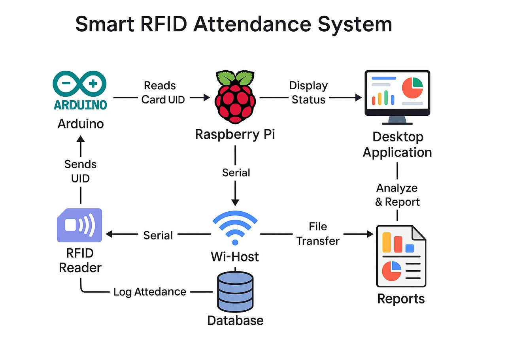

# 🔒 Smart RFID Attendance System (IoT Project)

> ⚠️ *Source code is private due to commercial use.*  
> This repository provides a full overview, architecture, and demo presentation of the system.

---

## 📖 Overview
The **Smart RFID Attendance System** is a commercial IoT solution designed to automate attendance management for schools, companies, and training centers.  
It uses **Arduino** with an **RFID reader (RC522)** to scan cards and a **Raspberry Pi** as the local server and database host.

Each RFID card is linked to a student or employee in the database.  
When the card is scanned, the system verifies it, records attendance into a daily session, and identifies whether the user arrived on time or late.  
All data can later be transferred via **Wi-Fi** to a desktop application for analysis and reporting.

## 🎥 Demo Video
🎬 [Watch The Device Demo on Streamable](https://streamable.com/vleoxc)
🎬 [Watch The Desktop App Demo on Streamable](https://streamable.com/4embt4)

---

## 🧩 System Architecture

### Workflow
1. **Arduino + RFID Module (RC522)** reads the card UID.  
2. Sends the UID to the **Raspberry Pi** through serial communication.  
3. **Raspberry Pi** checks the local database (SQLite/MySQL).  
4. If valid → logs attendance into today’s session.  
5. Session data saved and displayed on **MPI Screen**.  
6. At day’s end, the Pi shares DB files via Wi-Fi for analysis on the **Desktop App**.

---

## ⚙️ Features
- Real-time attendance logging via RFID  
- Daily sessions with timestamps  
- On-time / Late detection using system clock  
- Unauthorized card rejection  
- Admin-controlled student database  
- Desktop analytics software for insights  
- Automatic Wi-Fi data transfer (Pi → PC)  
- Exportable reports (CSV, XLSX, PDF)

---

## 💻 Connected Desktop Application – *Attendance Manager*
A standalone **desktop program** that analyzes and visualizes the attendance data collected by the Raspberry Pi.  
The Pi can act as a **Wi-Fi hotspot**, allowing the PC to connect directly and download the latest database exports.

### Key Features
- Import `.db` or `.csv` files from the Pi  
- Real-time and offline analytics dashboard  
- Charts of daily/weekly attendance rates  
- Filter by date, user, or session  
- CSV / Excel / PDF report export  
- Token-based secure Wi-Fi transfer  
- Optional automatic sync when connected  
- Audit log for imported sessions
- Vacation system

### Data Flow
1. Raspberry Pi collects and stores daily attendance in `attendance.db`.  
2. Pi starts Wi-Fi hotspot (e.g., SSID `Attendance-SYS-AP`).  
3. Admin PC connects to that network.  
4. Desktop App connects to the Pi via HTTP or SFTP to download DB.  
5. The app imports data and generates analytics dashboards.

---

## 🧠 Technologies Used
| Component | Technology |
|------------|-------------|
| **Hardware** | Raspberry Pi 3 / 4, Arduino Uno/Nano, RFID RC522, MPI Display |
| **Languages** | Python (Flask, Tkinter), C/C++ for Arduino |
| **Database** | SQLite / MySQL |
| **Communication** | Serial (UART), SPI, HTTP / SFTP (Wi-Fi Transfer) |
| **Desktop App** | Python + PHP / HTML & CSS & JS / Matplotlib (analytics and UI) |

---

## 🖼️ Screenshots
| | |
|--|--|
|  |  |

---

## 🔒 Privacy & Security
The full source code, database schemas, and transfer mechanisms are **private and proprietary**.  
Only the architecture, documentation, and demonstration media are published for educational and portfolio purposes.

---

## 👤 Author
**Ali Emad (Asgard OP)**  
💼 Full-stack Developer | IoT & Embedded Systems Designer  
📧 [aayth8700@gmail] 

---

## 💬 CV Description (English & German)
**English:**  
Developed a commercial IoT attendance system using Raspberry Pi and Arduino. Implemented RFID-based card verification, daily session tracking, Wi-Fi data transfer, and desktop analytics software.  

**Deutsch:**  
Entwickelte ein kommerzielles IoT-Anwesenheitssystem mit Raspberry Pi und Arduino. Implementierung von RFID-Kartenprüfung, täglicher Sessions-Verwaltung, Wi-Fi-Datenübertragung und Desktop-Analyse-Software.

---

© 2025 Ali Emad – All Rights Reserved.
